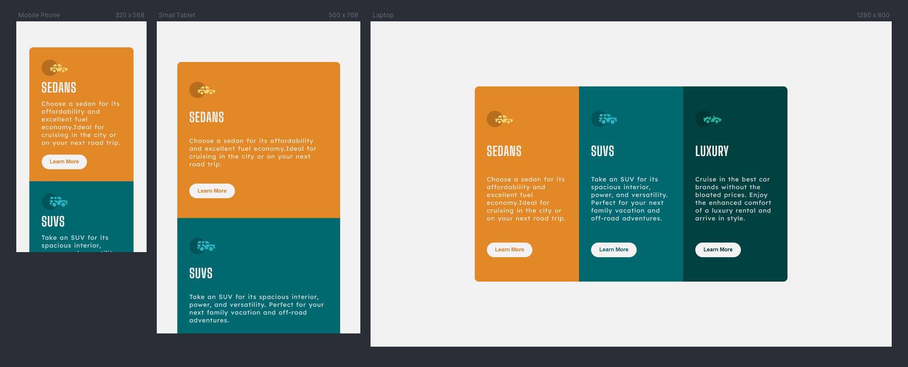

# Frontend Mentor - 3-column preview card component solution

This is a solution to the [3-column preview card component challenge on Frontend Mentor](https://www.frontendmentor.io/challenges/3column-preview-card-component-pH92eAR2-). Frontend Mentor challenges help you improve your coding skills by building realistic projects.

## Table of contents

- [Frontend Mentor - 3-column preview card component solution](#frontend-mentor---3-column-preview-card-component-solution)
  - [Table of contents](#table-of-contents)
  - [Overview](#overview)
    - [The challenge](#the-challenge)
    - [Screenshot](#screenshot)
    - [Links](#links)
  - [My process](#my-process)
    - [Built with](#built-with)
    - [What I learned](#what-i-learned)
    - [Continued development](#continued-development)
    - [Useful resources](#useful-resources)
  - [Author](#author)
  - [Acknowledgments](#acknowledgments)

## Overview

### The challenge

Users should be able to:

- View the optimal layout depending on their device's screen size
- See hover states for interactive elements

### Screenshot



### Links

- Solution URL: [FrontEnd Mentor Solution](https://www.frontendmentor.io/solutions/responsive-3-column-preview-component-card-HrpWx5VWMK)
- Live Site URL: [Live Site](https://muralidharabhat.me/3-column-preview-card-component-main/)

## My process

### Built with

- Semantic HTML5 markup
- Flexbox
- Mobile-first workflow
- Responsive Design

### What I learned

I learnt the responsive design thinking and media queries management.

```css
@media screen and (min-width: 769px) queries;
```

### Continued development

Still need to improve a lot on positioning and responsive design thinking.

### Useful resources

- [Google](https://www.google.com) - Google is always a best thing possible for development.

## Author

- Website - [Muralidhara Bhat KS](https://www.muralidharbhat.me)
- Frontend Mentor - [@SlenderShield](https://www.frontendmentor.io/profile/SlenderShield)
- Twitter - [@myself_MDB](https://www.twitter.com/myself_MDB)

## Acknowledgments

I would like to say thank you for [Melvin Aguilar](https://www.frontendmentor.io/profile/MelvinAguilar) who helped me by providing the necessary resources on the positioning.
